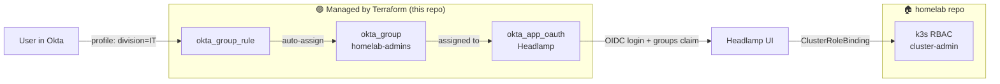

# 🔐 Okta GitOps

> Manage an [Okta](https://www.okta.com/) org as code — groups, auto-assignment rules, and OIDC apps — with Terraform, remote state, and a PR-gated pipeline.

[](https://github.com/yuandrk/okta-gitops/actions/workflows/plan.yml)


A small but real GitOps setup: modular Terraform, S3 remote state with native locking, and a GitHub Actions plan→apply pipeline using OIDC to AWS (no static keys).

**The use case:** [Headlamp](https://headlamp.dev/) — the homelab Kubernetes dashboard — uses Okta for login. Terraform owns the Okta side; the k3s cluster maps Okta groups to RBAC roles (in a separate repo).

## How it works



**Terraform owns:** groups (`okta_group`), auto-assign rules (`okta_group_rule`), and the OIDC app + its sign-on policy and group assignment (`okta_app_oauth`).
**It does _not_ own users** — they live in Okta (Admin Console / SCIM) as the source of truth; rules sort them into groups by profile attributes.

## Quick start

```bash
git clone https://github.com/yuandrk/okta-gitops && cd okta-gitops

cp terraform.tfvars.example terraform.tfvars   # add your Okta API token

terraform init -backend-config=backend.hcl
terraform plan        # always review first
terraform apply
```

## Layout

```text
okta-gitops/
├── main.tf · variables.tf · outputs.tf   # provider, backend, module calls, outputs
├── groups.yaml                           # groups + Okta Expression Language rules
├── apps.yaml                             # OIDC app integrations (Headlamp)
├── backend.hcl                           # S3 backend config
└── modules/
    ├── identity/   # okta_group + okta_group_rule
    └── apps/       # okta_app_oauth + sign-on policy/rule + group assignment
```

Change access by editing `groups.yaml` / `apps.yaml`, then open a PR — CI posts the plan as a comment, and merge to `main` applies it (after manual approval).

## Docs

| | |
| --- | --- |
| [Architecture](docs/architecture.md) | repo layout, modules (identity, apps) |
| [Source of truth](docs/source-of-truth.md) | why users live in Okta, how group rules + RBAC map |
| [Runbook](docs/runbook.md) | add a group/app/user, rotate the API token |
| [CI/CD](docs/ci-cd.md) | plan/apply workflows, OIDC trust, branch protection |
| [State backend](docs/state-backend.md) | S3 native locking, recovery |
| [Changelog](docs/changelog.md) | what was built, in order |

## Stack

| Layer | Choice |
| --- | --- |
| Identity provider | Okta developer org |
| IaC | Terraform `>= 1.10`, `okta/okta ~> 6.0` |
| Remote state | AWS S3 + native locking (`use_lockfile = true`) |
| CI/CD | GitHub Actions · OIDC to AWS · environment approval gate |
| Secrets | `TF_VAR_api_token` (CI) / `terraform.tfvars` (local, gitignored) |

## License

MIT.
