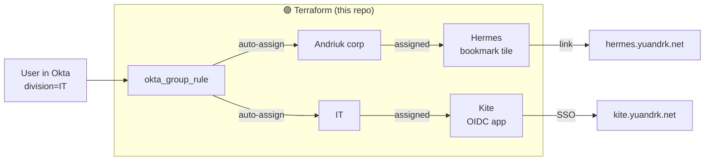

# 🔐 Okta GitOps

> Okta as the single sign-on for my homelab, managed with Terraform — groups, auto-assignment rules, and app integrations, changed only through reviewed PRs.

[](https://github.com/yuandrk/okta-gitops/actions/workflows/plan.yml)


## Why this exists

1. **Real SSO for the homelab.** Signing in to the Hermes dashboard and to Kite (the k3s dashboard) goes through Okta, and the Okta side lives here. (Kite replaced Headlamp, retired 2026-09-26.)
2. **A rehearsal for Okta at work.** Patterns like import-before-apply, drift checks and the MCP-assisted admin get worked out here first, on a developer org where mistakes are cheap.
3. **Learning and a portfolio.** Each resource is annotated with the Okta API call and Admin Console screen it maps to.

## What's in the org

Org: `integrator-7752059.okta.com` (developer org), with custom domain `okta.yuandrk.net`.

| Thing | Managed by | Notes |
| --- | --- | --- |
| Group `Andriuk corp` | Terraform | Rule `user.division == "IT"`. Gates the Hermes tile |
| Group `IT` | Terraform | Rule `user.division == "IT"`. Gates Kite |
| OIDC app `Kite` | Terraform | Web, `client_secret_post`, 2FA, `groups` claim (regex `IT`). Secret in 1Password `kite-credentials` |
| Bookmark `Hermes` | Terraform | Dashboard tile → `https://hermes.yuandrk.net` |
| OIDC app `Hermes Dashboard` | Admin Console | Native/PKCE public client. The module can't express it yet |
| OIDC app `okta-mcp-browser` | Admin Console | Login for the okta-mcp-server (device code). Bootstrap credential |
| Built-in groups, `okta_*` system apps | Okta | Okta adds and removes these on its own |
| **Users** | Admin Console | Never in Terraform. Group rules sort them into groups |

Why things are split this way: [docs/design.md](docs/design.md).

## How it works


```mermaid
flowchart LR
    U[User in Okta<br/>division=IT] --> R[okta_group_rule]
    R -->|auto-assign| G2[Andriuk corp]
    G2 -->|assigned| B[Hermes<br/>bookmark tile]
    B -->|link| HD[hermes.yuandrk.net]
    R -->|auto-assign| G3[IT]
    G3 -->|assigned| K[Kite<br/>OIDC app]
    K -->|SSO| KD[kite.yuandrk.net]

    subgraph TF["🟣 Terraform (this repo)"]
        R
        G2
        B
        G3
        K
    end
```

## Quick start

```bash
cp terraform.tfvars.example terraform.tfvars
# api_token comes from 1Password: op://homelab/okta-gitops/credential
aws login                                   # S3 state backend
terraform init -backend-config=backend.hcl
terraform plan                              # expect: No changes
```

## Making a change

Edit `config/groups.yaml` or `config/apps.yaml`, then open a PR. CI runs fmt, validate, tflint and the module tests, and posts the `terraform plan` as a comment. After the merge, the apply waits for manual approval in the `prod` environment. Recipes are in the [runbook](docs/runbook.md).

```text
okta-gitops/
├── versions.tf · providers.tf            # Terraform/provider versions, S3 backend, okta provider
├── locals.tf · main.tf                   # decode config/*.yaml → module calls
├── variables.tf · outputs.tf
├── backend.hcl                           # S3 backend config
├── config/
│   ├── groups.yaml                       # groups + group rules
│   └── apps.yaml                         # OIDC apps + bookmark tiles
└── modules/                              # each: versions · variables · outputs · README · tests/
    ├── identity/   # main.tf: okta_group, okta_group_rule
    └── apps/       # oidc.tf: okta_app_oauth (+ sign-on policy/rule); bookmarks.tf: okta_app_bookmark; group assignments
```

> **Two independent credentials.** Terraform uses an SSWS API token, which dies after 30 days without use. The okta-mcp-server uses its own device-code login. One can work while the other is dead, so check them separately.

## Docs

- [Runbook](docs/runbook.md): add a user, group, app or tile; rotate the token; drift check; state recovery
- [Design](docs/design.md): the decisions behind this setup, and lessons that carry over to work
- [CLAUDE.md](CLAUDE.md): rules for AI agents working in this repo

## License

MIT.
